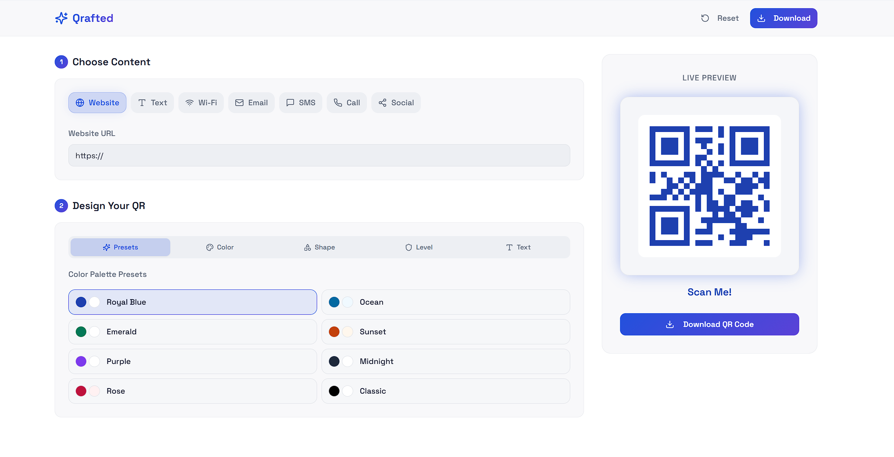
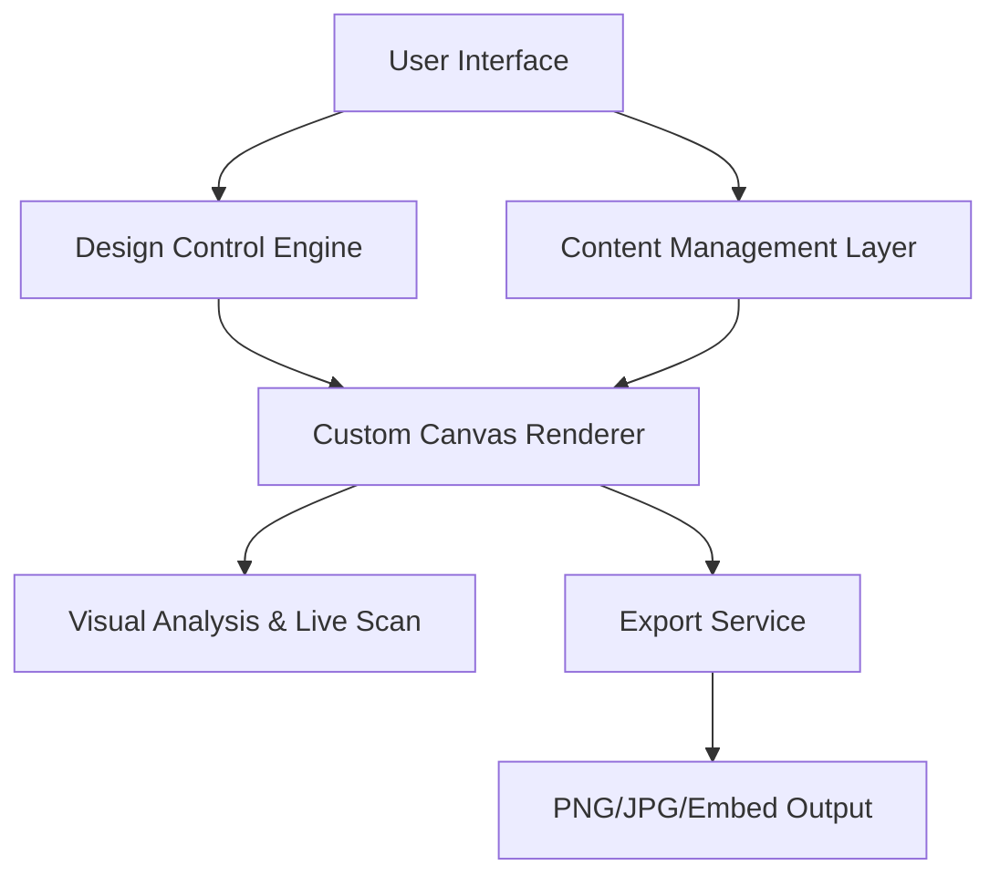

# Qrafted

[](LICENSE)
[](https://reactjs.org/)
[](https://vitejs.dev/)
[](https://www.typescriptlang.org/)
[](https://tailwindcss.com/)



Qrafted is an advanced, open-source QR code generation platform designed for businesses and creators who require high-precision design control and functional versatility. Built with a focus on visual excellence and technical robustness, it provides a comprehensive suite of tools for creating, testing, and deploying custom QR codes.

## Core Capabilities

### Functional Versatility
- **Dynamic Content Support**: Standardize URLs, plain text, Wi-Fi credentials, and business contact data into scannable modules.
- **Unified Preview Engine**: A proprietary viewer for multi-link profiles and real-time event countdowns.
- **Smart Logic (Beta)**: Context-aware QR types including link-in-bio styles and time-sensitive redirects.

### Advanced Design Architecture
- **Geometric Module Rendering**: Support for custom module shapes including rounded vertices, circular dots, and diamond facets.
- **Visual Effects Layer**: Native support for drop shadows, outer glows, and linear/radial gradient fills.
- **Structural Masking**: Precise clipping masks for heart, circle, and star-shaped QR silhouettes.
- **Logo Integration**: Seamless embedding of brand assets with adjustable error correction levels.

### Enterprise-Grade Exports
- **Format Flexibility**: High-resolution exports in PNG (with transparency support) and JPG.
- **Batch Processing**: Scalable generation tools for creating multiple unique codes in a single operation.
- **Developer API & Embeds**: Instant HTML code generation for seamless third-party website integration.

## System Architecture



## Technical Specification

| Parameter | Specification |
| :--- | :--- |
| **Frontend Framework** | React 18 with Vite |
| **Logic Layer** | TypeScript (Strict Mode) |
| **UI Components** | Radix UI & shadcn/ui |
| **Animation Engine** | Framer Motion |
| **Vector Rendering** | HTML5 Canvas API |
| **State Management** | React Hooks & TanStack Query |

## Getting Started

### Prerequisites
- Node.js (version 18.0 or higher)
- npm or yarn package manager

### Installation
1. Clone the repository:
   ```bash
   git clone https://github.com/katto-1204/qr-painter.git
   ```
2. Install dependencies:
   ```bash
   npm install
   ```
3. Launch the development server:
   ```bash
   npm run dev
   ```

## Deployment Guide

### Vercel / Netlify
This project is optimized for zero-config deployment on Vercel and Netlify. Connect your repository and use the default build settings:
- **Build Command**: `npm run build`
- **Output Directory**: `dist`

### GitHub Pages
To deploy to GitHub Pages, use the `gh-pages` package or the provided GitHub Actions workflow. Ensure the `base` path in `vite.config.ts` matches your repository name.

## Contributing

We welcome contributions of all scales. To contribute:
1. Fork the repository and create your feature branch.
2. Adhere to the established TypeScript and Tailwind CSS conventions.
3. Submit a pull request with a detailed description of your changes.

> [!IMPORTANT]
> Ensure all custom rendering logic is verified via the integrated Live Scan tool to maintain QR readability.

## License

This project is licensed under the MIT License - see the [LICENSE](LICENSE) file for details.
