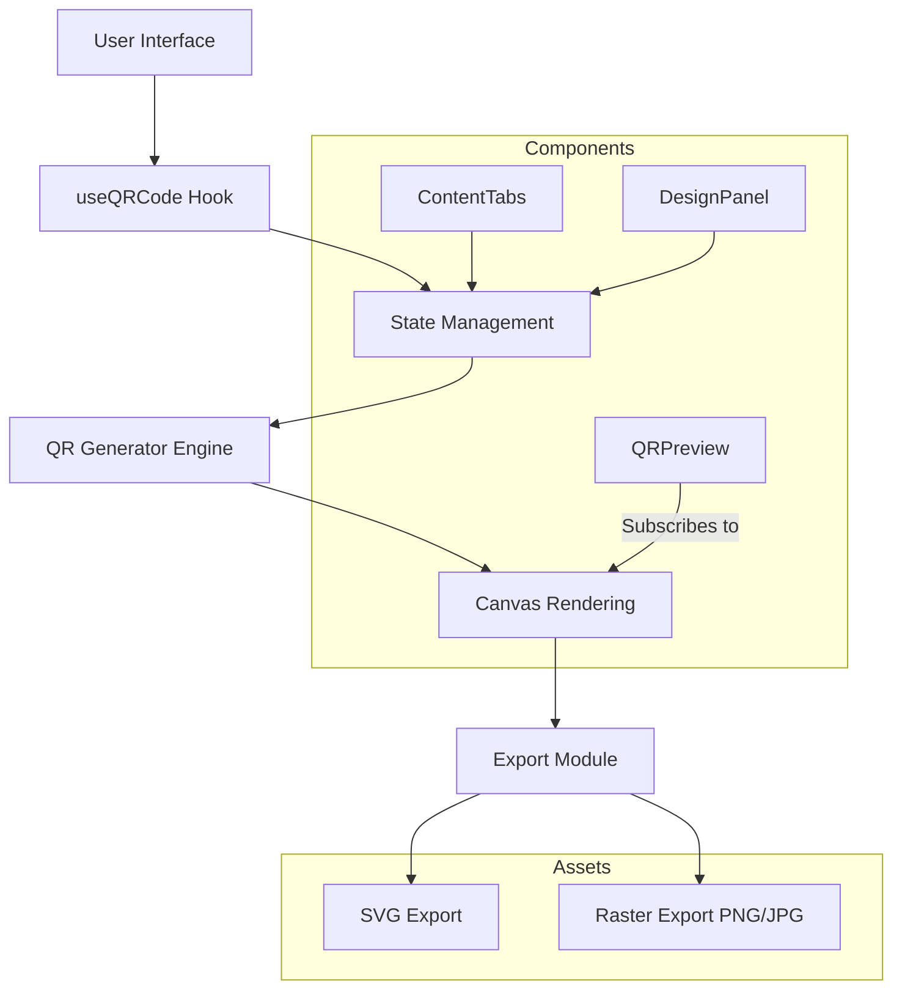

# Qrafted

[](https://opensource.org/licenses/MIT)
[](https://reactjs.org/)
[](https://vitejs.dev/)
[](https://www.typescriptlang.org/)
[](https://tailwindcss.com/)

Qrafted is an advanced, open-source QR code generation platform. It provides a sophisticated suite of tools for creating high-fidelity, customizable QR codes for a wide range of applications, including digital marketing, networking, and system integration.


## Application Architecture

The following diagram illustrates the high-level architecture and data flow within the Qrafted platform:



## System Capabilities

### Supported Content Formats

| Format | Description | Implementation Details |
| :--- | :--- | :--- |
| **URL** | Web addresses and deep links | Direct string encoding with protocol validation |
| **Raw Text** | Generic text or data strings | UTF-8 character support |
| **Wi-Fi** | Network credentials | WPA/WPA2/WEP configuration strings |
| **Email** | Predetermined email messages | mailto: protocol integration |
| **Social Media** | Profile and content links | Optimized for platforms like LinkedIn and GitHub |

### Design Parameters

| Parameter | Options / Range | Impact |
| :--- | :--- | :--- |
| **Error Correction** | L, M, Q, H | Data redundancy vs. pattern density |
| **Foreground Color** | Hex/RGB | Visual contrast and brand alignment |
| **Background Color** | Hex/RGB (Translucency support) | Integration with landing page backgrounds |
| **Pattern Style** | Square, Dot, Round | Aesthetic customization |
| **Eye Configuration** | Inner/Outer shape control | Advanced visual branding |

## Getting Started

> [!IMPORTANT]
> Ensure your development environment meets the Node.js version requirements (LTS recommended) before installation.

### Installation

1.  **Clone the Repository**:
    ```bash
    git clone https://github.com/yourusername/qr-painter.git
    cd qr-painter
    ```

2.  **Dependency Initialization**:
    ```bash
    npm install
    ```

3.  **Development Execution**:
    ```bash
    npm run dev
    ```

### Production Deployment

The application is optimized for static hosting providers. To prepare the production bundle:

```bash
npm run build
```

The resulting `dist` directory can be deployed to:
- **Vercel**: Simply connect the repository for automatic builds.
- **Netlify**: Use `npm run build` as the build command and `dist` as the publish directory.
- **GitHub Pages**: Utilize the specialized Vite deployment workflow.

## Repository Organization

```text
src/
├── components/
│   ├── qr/             # Domain-specific components for QR generation logic
│   └── ui/             # Core UI components utilizing shadcn/ui and Tailwind
├── hooks/              # Application state and event handling (useQRCode)
├── lib/                # Shared utilities and global configurations
├── pages/              # Primary route components (Generator, Index)
├── App.tsx             # Routing architecture and application wrapper
└── main.tsx            # DOM initialization and entry point
```

## Contribution Guidelines

Contributions are welcome. Please ensure that:
1.  All new features are accompanied by appropriate technical documentation.
2.  The formal, emoji-free documentation standard is maintained.
3.  Code changes align with the existing TypeScript and ESLint configurations.

## License

This software is released under the [MIT License](LICENSE).

---

Technical Direction by [katto-1204](https://github.com/katto-1204)
